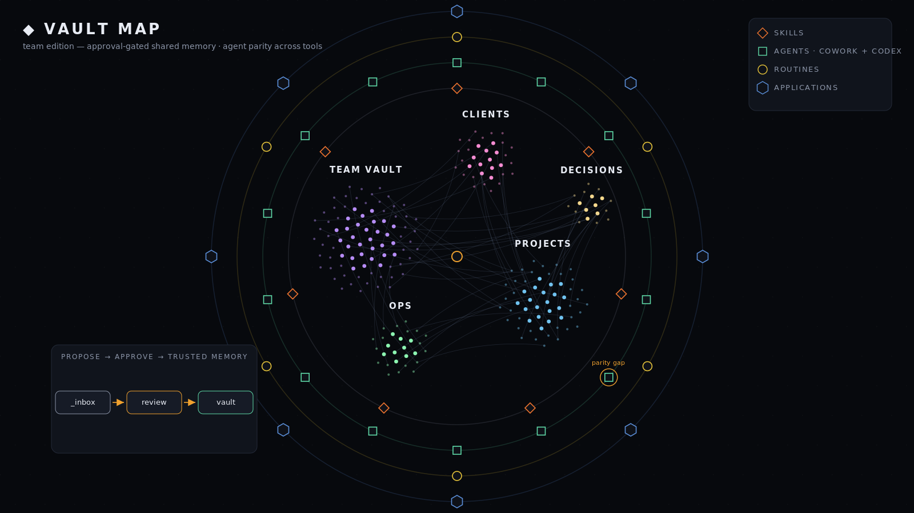
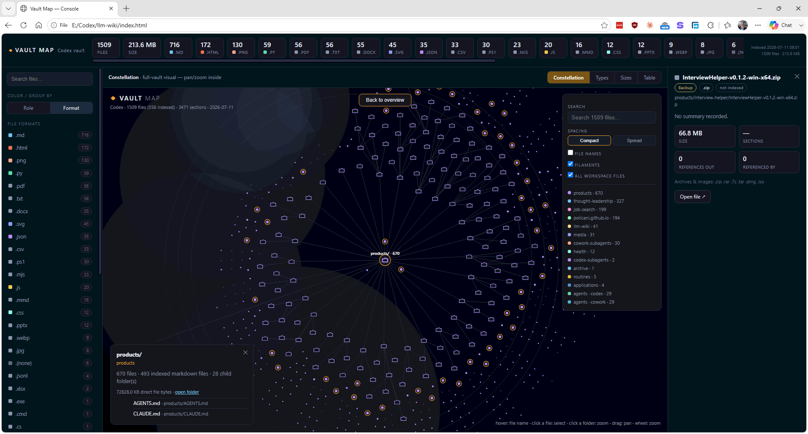
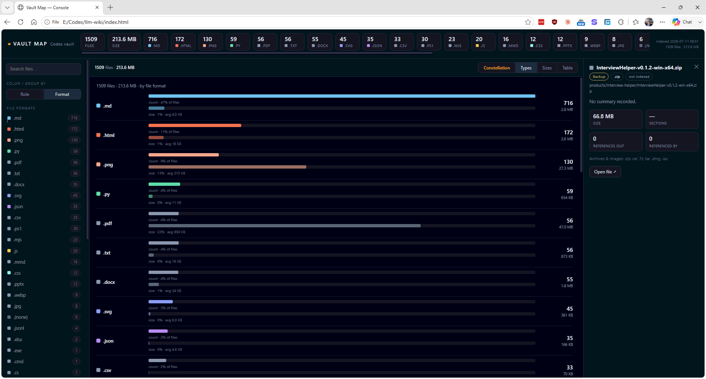
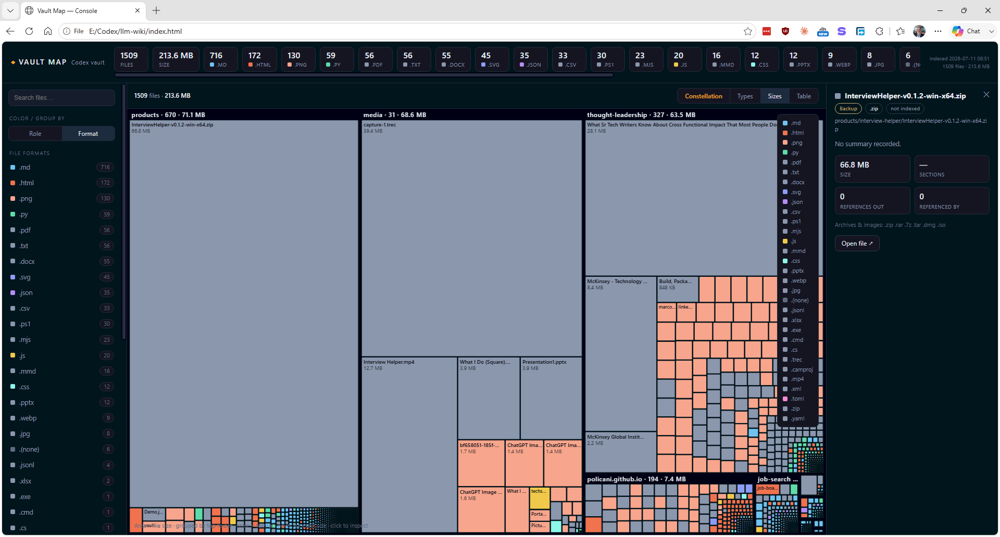
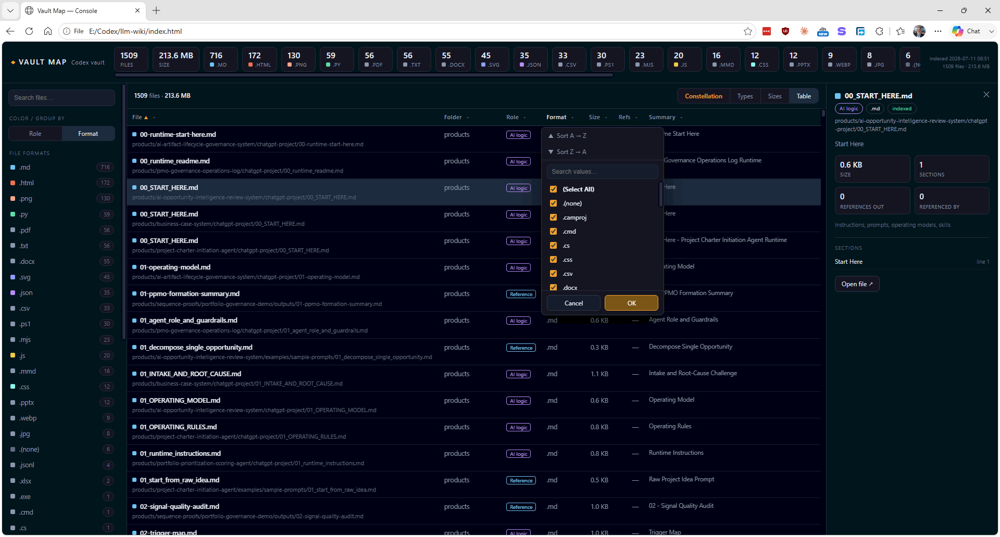
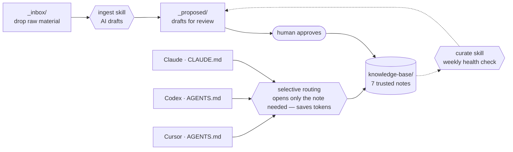

# Portable Cross-Agent Second Brain for Teams

A plain-markdown second brain that works the same in **Claude, Codex, and
Cursor** — through just two instruction files. It routes to the note it needs
instead of loading everything, so it **saves tokens**, and a propose-then-approve
process means nothing untrusted ever lands as fact.

No database. No vectors. No Obsidian. No lock-in. Clone it, fill in seven notes,
point any of three agents at it, and your AI stops forgetting who you are between
sessions.



*The bundled `vault-map.html` renders the shared vault like this — open it
straight from the folder, no server, no build step. Agent squares show every
capability in both Cowork and Codex form; a role missing its counterpart is
flagged as a parity gap. Nothing reaches trusted memory without approval.*

## New: a web-based Management Console

Your second brain now has a **console** — open
**`Open-Second-Brain-Console.bat`** to manage the whole vault in the browser.
It starts a local-only helper, so the **Refresh** button can rebuild the index
and reload the same page with an updated timestamp. No account is required and
your files never leave your machine.



*Constellation — the signature overview. It builds progressively on load, so you
watch the vault take shape instead of staring at a blank screen.*



*Types — every file classified by what it **is**: AI logic, reference, output,
template, office docs, media, software, backups. Counts and sizes at a glance.*



*Sizes — a treemap sized by bytes and colored by role. The heavy files and
folders pop, so cleanup targets are obvious.*



*Table — a sortable, Excel-style filterable list. Filter to just AI-logic files
or just outputs in two clicks; select any file for a full detail inspector.*

The console is one page with several lenses over the same vault:

- **Constellation** — the interactive map, now building in real time on load.
- **Types** — files grouped and colored by role or raw format, with counts and sizes.
- **Sizes** — a treemap that makes large files and folders obvious at a glance.
- **Table** — a sortable, **Excel-style filterable** list; filter to just AI-logic
  files, or just outputs, in two clicks.
- **Refresh** — rebuilds the local index and reloads the current console page.

Search, folder tree, per-type filters, and a detail inspector are always at hand.
In the constellation, use × to hide the search and display controls, then ☰ to
bring them back. Everything runs locally against your own notes — nothing is
uploaded.

> **This is the Team edition** — built for shared use, with a propose-then-approve
> gate so memory stays trustworthy when more than one person (and their agents)
> write to it. Working solo? The
> [Personal edition](https://github.com/policani/portable-cross-agent-second-brain-personal)
> drops the gate: the AI drafts straight into your notes.

## How it works



New material is always **proposed**, never written straight to memory; a human
approves before anything in `knowledge-base/` becomes trusted. On the read side,
each of the three agents **routes to the one note it needs** instead of loading
the whole vault — that's the token-saving retrieval layer. The same vault is read
by all three agents through two files kept in parity: Claude reads `CLAUDE.md`;
Codex and Cursor both read `AGENTS.md` (Cursor reads it natively).

The routing is enforced by code, not just convention. The bundled **`brain.py`**
(one file, Python stdlib, zero dependencies) indexes every heading-level section
of the vault and answers "where is X?" deterministically — keyword scoring,
`path:line` targets, best section printed straight to the terminal — before a
single model token is spent. The same generated index feeds the **web Management
Console** (`index.html`) and the standalone **Constellation map** (`vault-map.html`).
The map opens directly from the filesystem; use `Open-Second-Brain-Console.bat`
when you want Refresh to rebuild and reload the console in the same browser page.

## Why it's valuable

Done-for-you "second brain" builds are advertised around **$5,000**. This is the
same idea, as an open, adaptable starter kit — but the real payoff shows up at
scale.

Because every agent reads one shared context and routes to only the note it
needs, teams stop re-pasting the same background into every session, and the
model stops re-reading context it doesn't need. At enterprise volume that token
economy compounds: lower usage bills that can recover the cost of building it in
a matter of months. The mechanism is simple — **pay for context once, route to
it precisely, reuse it everywhere** — and the savings grow with every seat and
every session. (Actual payback depends on usage; the lever is fewer and smaller
context loads.)

## Status

Working starter kit. Copy the folder, fill the vault, point your agent at it. The
structure and rules are stable; the seven notes ship as templates with one small
fictional example.

## Why this exists

Most "AI second brain" setups are either too complicated (vector stores,
plugins, a tool to learn) or locked to one vendor. This is the opposite:

- **Uncomplicated.** Seven markdown files and two instruction files. You can read
  the whole thing in ten minutes. The knowledge is yours, in a format any AI can
  read, forever.
- **Interchangeable across agents.** Claude reads `CLAUDE.md`; Codex and Cursor
  read `AGENTS.md` (Cursor reads it natively as of 2026). Two files in parity =
  one vault that behaves consistently in all three. Switch tools, or use all
  three on the same brain, with zero migration.
- **Token-efficient by design.** Selective routing means the agent reads a small
  map and opens only the relevant note — retrieval without a vector database.
  It's what keeps the no-database approach cheap as the vault grows.
- **Trustworthy.** New material flows `_inbox/` → ingest → `_proposed/` → you
  approve. AI only ever proposes; a human approves before anything becomes
  memory. That invariant is what makes it safe to rely on.

## What's inside

```
CLAUDE.md / AGENTS.md   two instruction files, kept in parity (the parity is the product)
knowledge-base/         the 7 notes: snapshot, key-people, preferences-and-rules,
                        project-history, decisions-and-rationale, open-loops, source-links
_inbox/  _proposed/     capture staging and the approval queue
skills/ingest/          capture new material into proposed notes
skills/curate/          weekly health check
brain.py                deterministic retrieval: index + query, no dependencies
index.html              web Management Console — Constellation, Types, Sizes, Table
vault-map.html          the Constellation map on its own, opens from the filesystem
serve-second-brain.py   localhost-only helper for live console refreshes
Open-Second-Brain-Console.bat  one-click launcher for the live console
INSTALL.md              setup for Claude, Codex, and Cursor
```

## The 7 notes

A working memory is seven kinds of note — that's the whole schema:

1. **Snapshot** — who they are, one paragraph
2. **Key people** — stakeholders, roles, who decides
3. **Preferences & rules** — how they like things done, and the red lines
4. **Project history** — what happened, in order
5. **Decisions & rationale** — what was decided and why
6. **Open loops** — commitments still in the air
7. **Source links** — where each fact came from

Each note carries frontmatter with a `status` (extracted / inferred / verified /
deprecated) and `sensitivity` (public / internal / confidential / restricted), so
a guess is never mistaken for a fact.

## How the routing works (the token-saver)

The instruction files carry a small routing map — "for this kind of question,
open this note" — and the rule *don't load the whole vault by default*. The agent
reads the map, opens only what's relevant, and skips the rest. With seven notes
the map is tiny; the point is that it keeps working as the vault grows to seventy.
That's retrieval-by-routing instead of retrieval-by-embedding: no vector store,
no index server, just a table and a discipline — and a smaller context bill every
session.

## How to evaluate this in 5 minutes

1. Read `CLAUDE.md` and `AGENTS.md` side by side — note they're the same rules,
   phrased per client, including the routing map. That's the portability and the
   token-saving, made concrete.
2. Skim `knowledge-base/snapshot.md` to see the note shape and the example.
3. Read `skills/ingest/SKILL.md` to see how capture stays propose-then-approve.
4. Then the real test: open the folder in Claude (or Codex, or Cursor), fill the
   snapshot, and ask for one real task using only the vault. Run the same ask in
   a blank chat with no vault. The difference is the point.

## Quick start

See `INSTALL.md`. Short version: fill `knowledge-base/`, point your agent at the
folder, run **ingest** when new material shows up, run **curate** weekly, approve
drafts from `_proposed/`.

## Scope boundaries

This is a starter kit, deliberately small. It does **not** include: a hosted
server or database, automated connectors (you wire those per environment), or
migration of historical documents. Those are the natural next step up, not the
first delivery.

---

Built by [Marco Policani](https://policani.net). MIT licensed — plain markdown,
no dependencies, yours to run and adapt.
